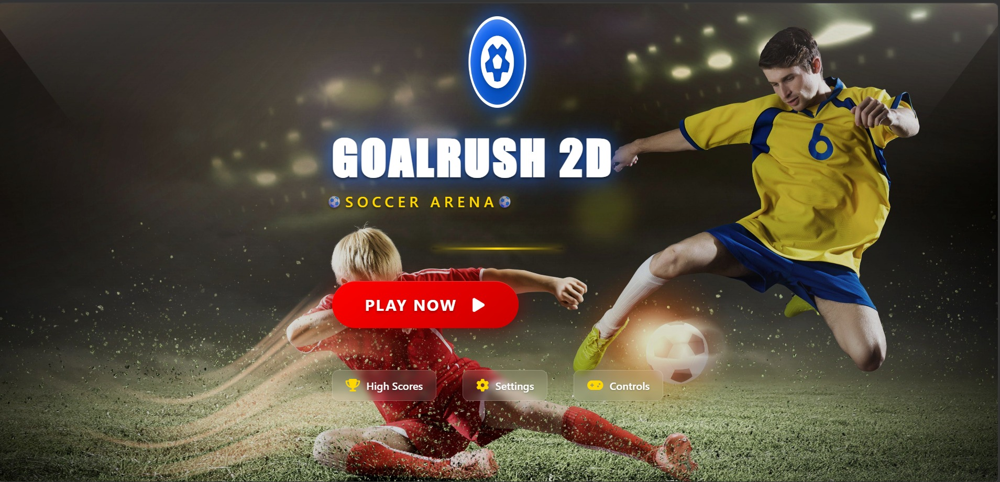

# GoalRush 2D

GoalRush 2D is a browser-based 2D football game I built as an individual project using HTML, CSS, and JavaScript. The game runs on an HTML5 Canvas and includes a full player flow: launch screen, main menu, character selection, settings, high scores, match play, pause, replay, and match over screens.



## Project Overview

I wanted this project to feel like a complete small game instead of only a canvas demo. The main focus was to build a playable football match with a simple opponent, responsive game screens, audio feedback, saved scores, and a UI that feels more polished than a basic assignment prototype.

The game is intentionally lightweight. There is no framework, no build step, and no backend. Everything runs directly in the browser from the files in this repository.

## Documentation

- [Project documentation PDF](docs/GoalRush_2D_Project_Documentation.pdf)
- [Original UI screenshots PDF](docs/GoalRush_2D_Football_Game_Screenshots.pdf)

The documentation PDF includes the project summary, feature breakdown, folder structure, controls, gameplay flow, and selected UI screenshots.

## Main Features

- Launch screen with game branding, background visuals, and start action.
- Main menu with start match, settings, character selection, high scores, and credits.
- Canvas-based football match with player movement, jumping, kicking, ball physics, goals, and match timer.
- Simple AI opponent that follows the ball, jumps, and reacts to player attacks.
- Character selection for both the player and opponent.
- Audio settings for music and sound effect volume.
- Background music, crowd ambience, kick sound, goal sound, and menu selection sound.
- High score and score history saved with `localStorage`.
- Pause, replay, and return-to-menu flows.

## Controls

| Key | Action |
| --- | --- |
| `Enter` | Open the menu from the launch screen, or restart during gameplay |
| `Left Arrow` / `Right Arrow` | Move the player |
| `Up Arrow` | Jump |
| `D` | Kick the ball |
| `Space` or `Q` | Use a special shot |
| `Esc` | Pause or resume the match |

## Tech Stack

| Part | Used For |
| --- | --- |
| HTML5 | Page structure, game screens, menu panels, and canvas element |
| CSS3 | Layout, animation, responsive styling, panels, scoreboard, and visual polish |
| JavaScript | Game loop, input handling, physics, AI logic, scoring, audio, and local storage |
| HTML5 Canvas | Drawing the field, players, ball, goals, and gameplay state |
| LocalStorage | Saving high scores, selected characters, and volume settings |

The only external dependency is Font Awesome through a CDN for the UI icons. The game assets themselves are stored locally in the `resources` folder.

## Run Locally

1. Clone or download the repository.
2. Open `index.html` in a modern browser.
3. Click `Play Now` or press `Enter`.

No package installation is required. If the browser blocks autoplay, click once on the page and the audio can start after that user interaction.

## Project Structure

```text
javascript-football-game/
|-- index.html
|-- style.css
|-- game.js
|-- resources/
|   |-- images, player sprites, field backgrounds
|   `-- music and sound effects
|-- docs/
|   |-- GoalRush_2D_Project_Documentation.pdf
|   |-- GoalRush_2D_Football_Game_Screenshots.pdf
|   `-- screenshots/
`-- README.md
```

## Implementation Notes

The game loop is handled with `requestAnimationFrame`, while the main gameplay state is stored in JavaScript objects for the player, opponent, and ball. Collision detection is kept simple so the game stays easy to understand and modify.

I used `localStorage` because this is a static project and I did not want to add a backend just to keep high scores or settings. It also keeps the project easy to run on any machine.

## Future Improvements

- Add a difficulty selector for the opponent AI.
- Add touch controls for mobile gameplay.
- Split `resources` into `images`, `audio`, and `video` folders if the asset list grows.
- Add a browser smoke test for the launch screen, menu, and match start flow.
